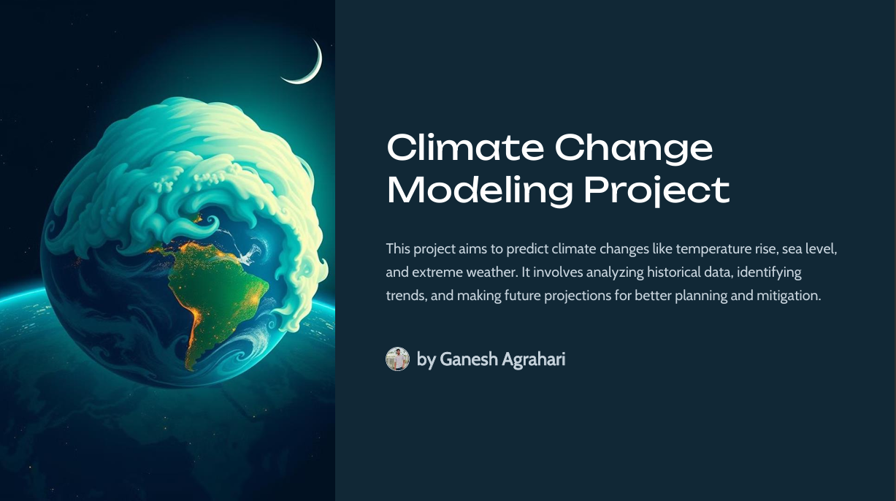
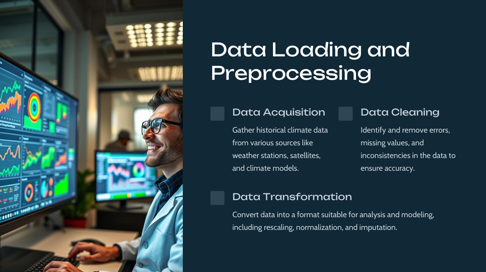
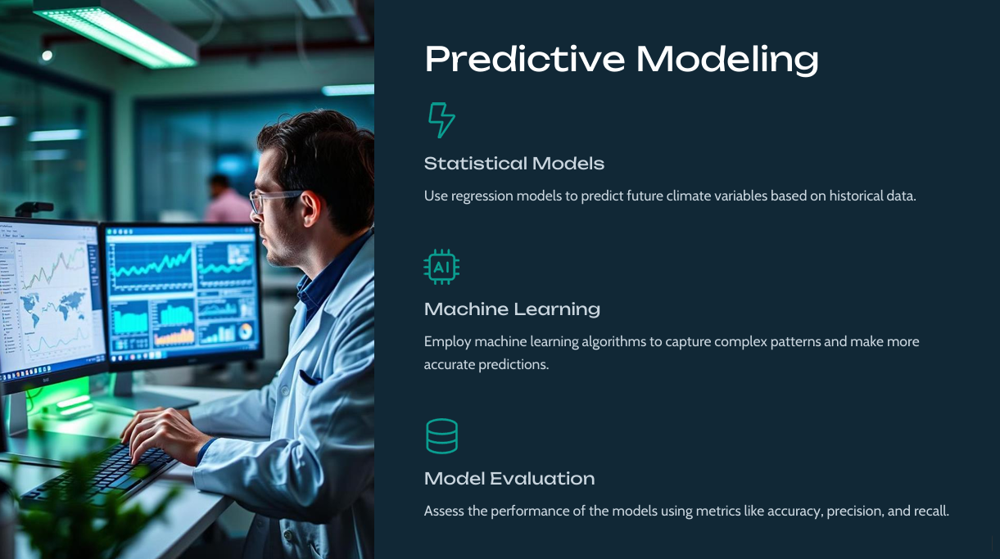
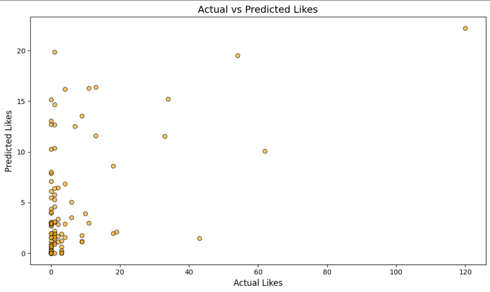
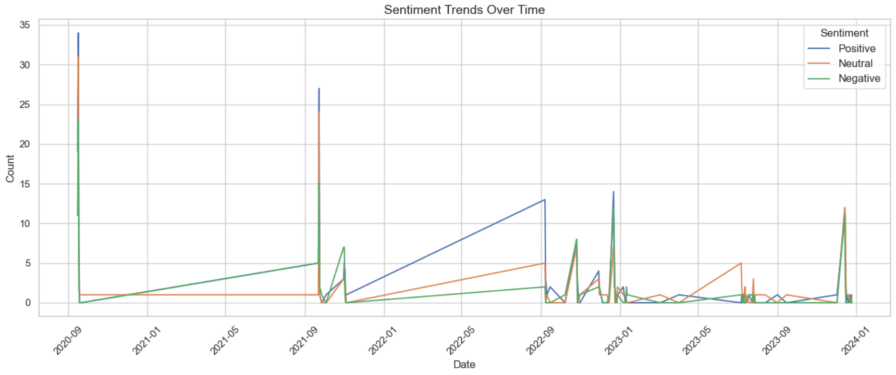

# 🌍 Climate Change Model

## 📌 Introduction
This Climate Change Model was developed during my online internship at **Unified Mentor**. The project leverages **Natural Language Processing (NLP) and Machine Learning** techniques to analyze climate change-related data, predict sentiment trends, and assess public perception regarding climate change.

## 🚀 Features
- 🔹 **Data Collection & Preprocessing**: Extracting and cleaning climate-related data from various sources.
- 🔹 **Sentiment Analysis**: Using NLP to determine the sentiment of climate-related discussions.
- 🔹 **Predictive Modeling**: Applying machine learning models to predict climate-related sentiment trends.
- 🔹 **Visualization**: Presenting insights through interactive graphs and charts.

## 📂 Project Structure
```
📁 Climate Change Model
├── 📜 Climate Change Modeling.pdf	# Project documentation
├── 📜 Climate-Change-Modeling-Project-PPT.pdf	# Project presentation
├── 📊 climate_nasa.xlsx	# Dataset
├── 📄 engagement_analysis.ipynb	# Analyzing public engagement trends
├── 🤖 ml_model.ipynb	# Machine learning model for predictions
├── 💬 Sentiment_analysis.ipynb	# NLP-based sentiment analysis
└── README.md	# Documentation
```

---

## 🖼️ Screenshots

### 1️⃣ Introduction to the Model


### 2️⃣ Data Preprocessing


### 3️⃣ Predictive Modeling


### 4️⃣ Actual vs Predicted Sentiments


### 5️⃣ Sentiment Trends Over Time


---

## 🛠️ Technologies Used
- 🐍 **Python**
- 📜 **NLTK & spaCy** (for NLP processing)
- 📊 **Scikit-learn** (for ML models)
- 📈 **Matplotlib & Seaborn** (for data visualization)
- 🔢 **Pandas & NumPy** (for data manipulation)

## ⚙️ How to Run
1. 📥 Clone the repository:
   ```bash
   git clone https://github.com/your-repo/climate-change-model.git
   ```
2. 📦 Install dependencies:
   ```bash
   pip install -r requirements.txt
   ```
3. ▶️ Run the analysis:
   ```bash
   python src/main.py
   ```

## 🔮 Future Improvements
- ✅ Enhancing predictive accuracy with deep learning techniques.
- ✅ Expanding data sources for better insights.
- ✅ Developing a web-based interactive dashboard for real-time tracking.

## 🤝 Contact
For any queries or contributions, feel free to connect with me on [LinkedIn](https://www.linkedin.com/in/ganesh-agrahari-727746263/).
